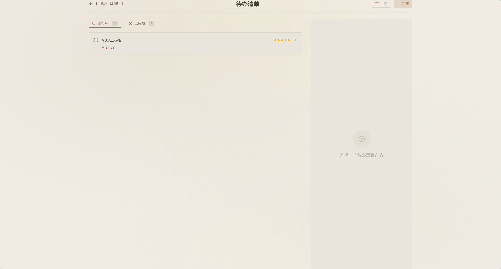
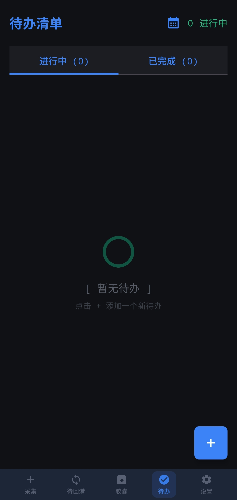

# 🛰️ HomeDock

<p align="right">
  🌐 Language:
  English | <a href="./README.zh-CN.md">简体中文</a>
</p>

<p align="center">
  
</p>

<p align="center">
  <b>A personal base that lives entirely inside your local network.</b><br/>
  <i>An open-source offline-first LAN playground for dorm rooms, desks, and disconnected spaces.</i>
</p>

<p align="center">
  
  
  
  
  
  
</p>

---

## ✨ What is HomeDock?

**HomeDock** is a dual-device system designed to run entirely inside a local network.

It is made of:

- **Web Base** — a local web app running on your computer, acting as the final home for your content.
- **Android Terminal** — a native Android app used to collect lightweight capsules such as text, images, and short audio.

It is **not**:

- a cloud product
- a serious productivity suite
- a team collaboration platform
- a traditional note-taking app

It is closer to:

- a personal base inside your dorm or room
- a tiny system that only exists in your LAN
- an offline toy with a ritualized sync experience

---

## 🧠 Core Idea

What can we still build when there is **no internet**?

HomeDock explores a simple answer:

> Build a small system that belongs only to you, and let it live entirely inside your local network.

That means:

- no accounts
- no cloud sync
- no internet dependency
- no public data flow
- no "upload to somewhere else" by default

Instead, the project focuses on:

- **LAN-first interaction**
- **offline-first collection**
- **ritualized return-to-base sync**
- **a private, low-stimulation digital space**

---

## 🔄 Core Loop

The central interaction of HomeDock is not just "upload" — it is:

> **Return to Dock**

A typical flow looks like this:

1. Capture something on your phone

   - a sentence
   - a photo
   - a short recording
2. Store it locally on Android
3. Return to the same local network
4. Let the Android app discover the Web Base
5. Tap **Return to Dock**
6. Watch the content arrive in your Web Base
7. View, organize, archive, and revisit it on desktop

This "return" loop is the heart of the project.

---

## 🧩 System Overview

### 🖥️ Web Base

The **Web Base** is the main base station running locally on your computer.

It is responsible for:

- receiving capsules from Android
- storing metadata in SQLite
- storing uploaded media locally
- providing the main desktop experience
- showing:
  - home base
  - fragment wall
  - echo
  - archive vault
  - todos
  - settings
  - base map (visualization)

### 📱 Android Terminal

The **Android Terminal** is the lightweight mobile side of the system.

It is responsible for:

- collecting capsules
- storing them offline first
- discovering the base on the local network
- triggering return-to-dock sync
- maintaining a local queue of pending items

Supported capsule types:

- text
- image
- audio

---

## 🚀 Features

### Current core features

- 📡 Automatic local network discovery via mDNS / NSD
- 📦 Offline-first local queue on Android
- 🔄 One-tap "Return to Dock" synchronization
- 🧱 Fragment Wall for browsing returned content
- 🎧 Support for text / image / audio capsules
- 🗂️ Archive Vault for browsing and managing stored items
- 📝 Todos page
- 🗺️ Base Map for visualizing capsule distribution
- 🔔 Connection status indicator
- ⚙️ Settings page
- 🌙 Theme support (day / night / auto, depending on current implementation state)
- 🤫 **Silent Mode** - A ultra-minimal dark mode that disables all animations and reduces visual noise. Perfect for deep focus or when you want an even calmer interface. Toggle via the top navigation bar.
- 🗑️ Trash management for deleted items
- 📋 Pending organization queue

### Experience goals

- no account needed
- no cloud dependency
- local ownership of data
- a calmer, more ritualized sync experience
- dual-device interaction that feels like "bringing things home"

---

## 🖼️ Screenshots

<p align="center">
  
  
  
  
  
  
  
  
  
  
</p>

---

## 🏗️ Architecture

For a more detailed technical route:

- [Technical Route](./assets/TECHNICAL_ROUTE.md)

### Web stack

- React 19 + Vite 8
- Node.js + Express 5
- SQLite
- Tailwind CSS 4 + Framer Motion 12
- ECharts 5 + echarts-for-react
- React Router 7
- Axios, Multer, Bonjour-service, dayjs, Lucide icons

### Android stack

- Kotlin + Jetpack Compose
- Material 3
- Room (local database)
- Retrofit + OkHttp (networking)
- CameraX (camera capture)
- Coil (image loading)
- NSD / mDNS discovery
- Accompanist (permissions)
- Min SDK 26 / Target SDK 34 / JVM 17

### Network / sync

- HTTP API for capsule upload
- mDNS / Bonjour / NSD for local service discovery
- SSE support exists in the codebase and is intended for real-time update feedback

---

## 📂 Project Structure

```text
.
├── web-base/
│   ├── server/
│   │   ├── db.ts          # SQLite connection & queries
│   │   ├── events.ts     # SSE event handling
│   │   ├── index.ts      # Express app entry
│   │   ├── nsd.ts        # Bonjour/mDNS broadcast
│   │   └── routes.ts     # API routes
│   ├── src/
│   │   ├── components/    # 20+ React components
│   │   │   ├── charts/   # ECharts wrappers
│   │   │   ├── context/  # React context providers
│   │   │   └── hooks/    # Custom hooks (useSSE, useToast, useConnectionStatus)
│   │   ├── pages/        # 6 pages: Archive, Echo, Home, Settings, Todos, Wall
│   │   └── ...
│   ├── package.json
│   └── vite.config.ts
├── android-terminal/
│   ├── app/src/main/java/com/personalbase/terminal/
│   │   ├── data/         # Room: Database, DAOs, Entities, Repository
│   │   ├── nsd/          # NsdHelper for mDNS discovery
│   │   ├── ui/
│   │   │   ├── screens/  # 8 Compose screens
│   │   │   └── Theme.kt
│   │   └── ...
│   └── build.gradle.kts
├── assets/
│   ├── TECHNICAL_ROUTE.md
│   └── screenshots/
└── README.md
```

---

## 🔧 Prerequisites

Before you start, make sure you have the following installed:

### For Web Base

| Requirement | Version | Notes |
|-------------|---------|-------|
| **Node.js** | ≥ 18 recommended | [Download](https://nodejs.org/) |
| **npm** | Comes with Node.js | Or use `pnpm` / `yarn` |

### For Android Terminal

| Requirement | Version | Notes |
|-------------|---------|-------|
| **Android Studio** | Latest stable | [Download](https://developer.android.com/studio) |
| **JDK** | 17 | Bundled with Android Studio |
| **Android device** | SDK 26+ (Android 8.0) | Real device recommended for full NSD testing |
| **Gradle** | Bundled | Auto-installed by Android Studio |

### For the full loop

- A computer and Android phone on the **same LAN / Wi-Fi**
- (Optional for NSD) A non-emulator Android device — emulators cannot receive mDNS broadcasts from the host machine

---

## ⚡ Getting Started

### 1. Run the Web Base

```bash
cd web-base
npm install
npm run dev
```

This starts:
- **Frontend**: Vite dev server at `http://localhost:5173`
- **Backend**: Express API at `http://localhost:3000`

### 2. Run the Android Terminal

1. Open `android-terminal/` in Android Studio
2. Sync Gradle
3. Connect a real Android device (on same Wi-Fi as your computer)
4. Run the app

### 3. Try the full loop

- Create a capsule on Android (text / image / audio)
- Wait for the base to be discovered via mDNS
- Tap **Return to Dock**
- Watch the content arrive in your Web Base
- Browse, organize, or archive it on desktop

---

## 🧪 Current Status

> **Early but usable**

What this means:

- the core dual-device flow is already present
- Android can create and store capsules locally
- the base can receive and store returned content
- the project is usable for experimentation and iteration
- the UI / UX is still evolving
- sync consistency and some edge cases are still being improved

This is an actively iterated project, not a polished final product.

---

## 🎯 Design Principles

HomeDock follows a few simple principles:

### 1. LAN-first

The system should still make sense even without internet access.

### 2. Offline-first

Create locally first. Decide later when to sync back.

### 3. Ritual over generic sync

"Return to Dock" should feel more intentional than a normal upload button.

### 4. Private by default

Content should stay in your personal network and your own devices.

### 5. Small systems are worth building

Even tiny, personal, offline systems can be meaningful and fun.

---

## 🛠️ Development Notes

Current areas of attention include:

- real-time sync feedback between Android and Web
- SSE verification and fallback strategy
- stronger UI structure and page density
- richer organization for fragments and archives
- better desktop layout utilization
- more cohesive interaction language across both ends

---

## 🗺️ Roadmap

Planned or possible next steps:

- improve real-time Web update after Android return
- richer archive and fragment organization
- better "echo" mechanics
- stronger visual system on desktop
- optional visualization layer
- more robust sync history / status feedback
- smoother empty states and editing flows

---

## 🤝 Contributing

Ideas, issues, design feedback, and pull requests are welcome.

You can contribute through:

- bug fixes
- UI / UX improvements
- sync / networking improvements
- Android experience polish
- architecture cleanup
- weird but fun experiments

This project is intentionally playful — thoughtful experiments are welcome.

---

## 📜 License

This project is licensed under the **Apache License 2.0**.

That means you are generally free to:

- use
- modify
- distribute
- build on top of it

while respecting the Apache-2.0 terms.

---

## 🌀 Final Note

HomeDock is not something you *need*.

It is something you build so that, even when the internet is gone,

> you still have a system that belongs only to you.
