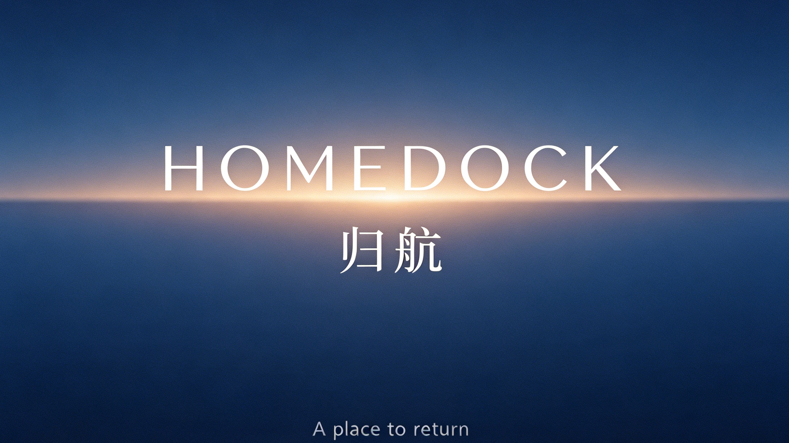
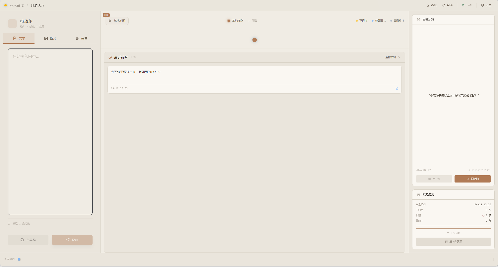
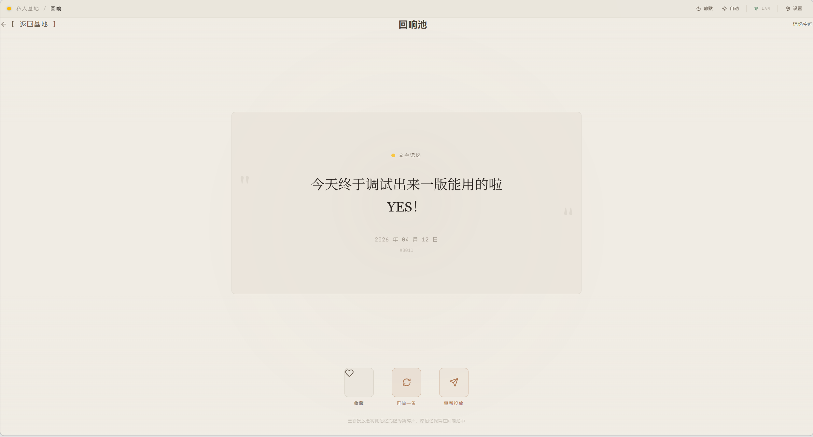
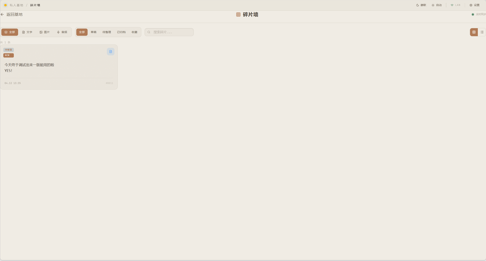
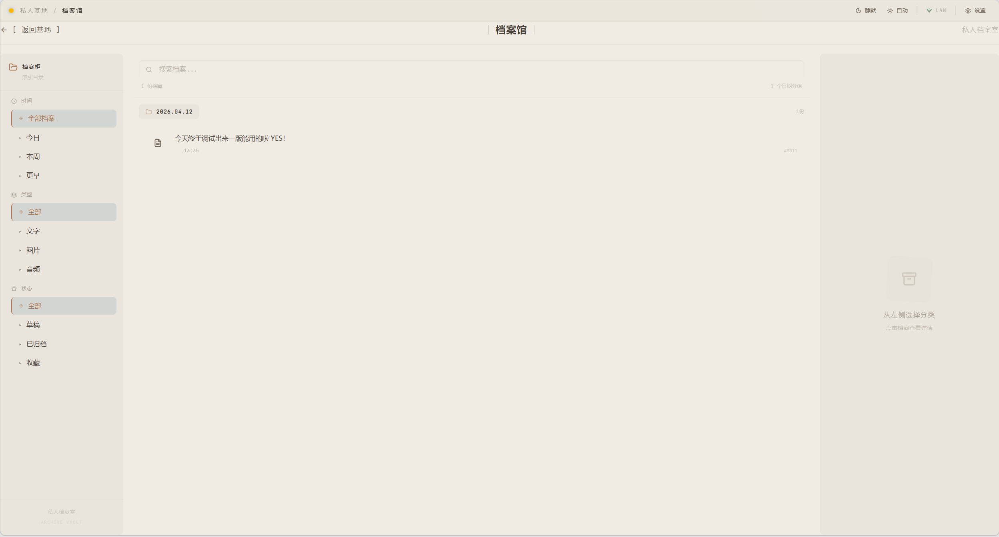
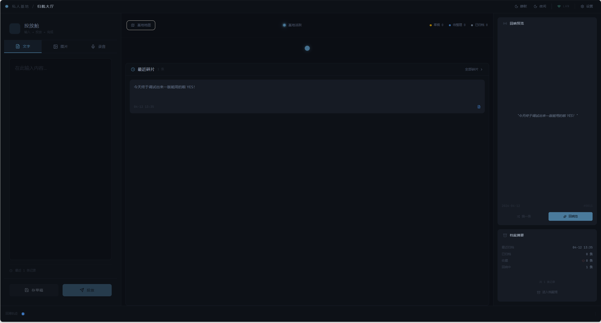
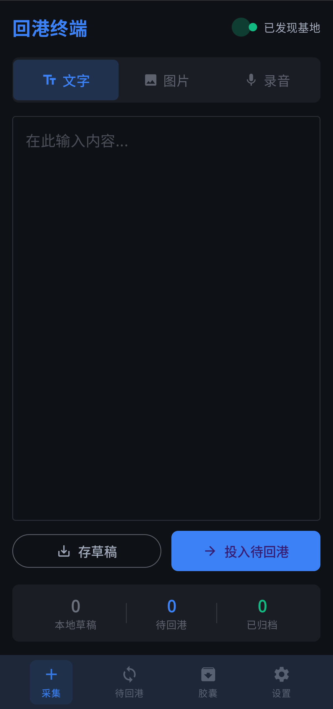
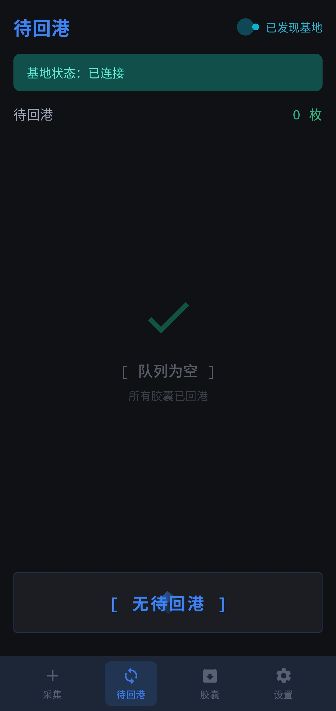
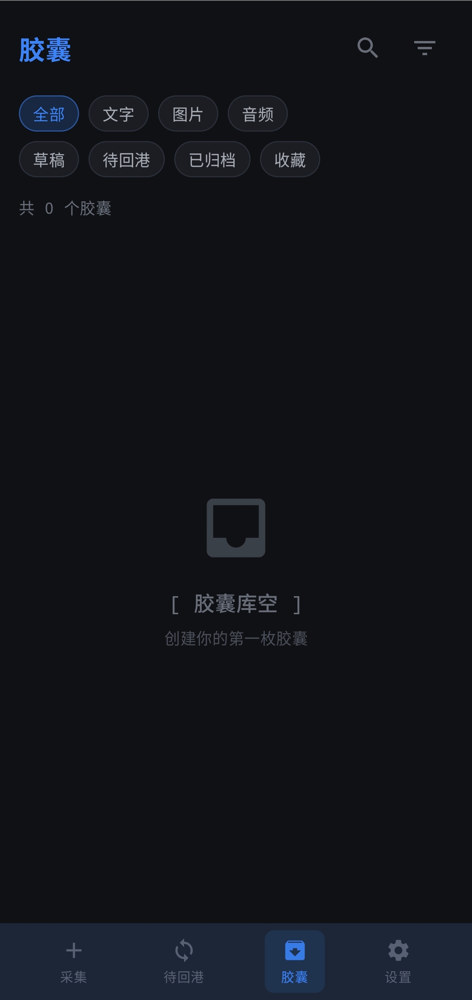

# 🛰️ 归航 HomeDock

<p align="right">
  🌐 语言：
  <a href="./README.md">English</a> | 简体中文
</p>

<p align="center">
  
</p>

<p align="center">
  <b>一个完全存在于局域网里的私人基地。</b><br/>
  <i>一个适合宿舍、书桌和无互联网环境的开源离线局域网小玩具。</i>
</p>

<p align="center">
  
  
  
  
  
  
</p>

---

## ✨ 项目简介

**归航** 是一个完全运行在局域网中的双端系统。

它由两部分组成：

- **Web Base / 主基地** —— 运行在电脑本地的 Web 应用，作为内容最终归宿。
- **Android Terminal / 回港终端** —— 原生安卓 App，用于采集文字、图片和短音频等轻量内容。

它**不是**：

- 云服务产品
- 严肃的生产力套件
- 团队协作平台
- 传统意义上的笔记工具

它更像是：

- 宿舍或房间里的一个私人基地
- 一个只存在于局域网里的小系统
- 一个带有“回港”仪式感的离线玩具

---

## 🧠 核心理念

当**没有互联网**的时候，我们还能做什么？

归航 想尝试给出一个简单的回答：

> 在局域网里，搭一个只属于自己的小系统。

这意味着：

- 没有账号体系
- 没有云同步
- 没有互联网依赖
- 没有数据外流
- 默认不把内容“上传到别处”

它更关注的是：

- **局域网优先的交互**
- **离线优先的采集**
- **带仪式感的回港同步**
- **一个私有、低刺激的数字空间**

---

## 🔄 核心体验

归航 的核心动作不是普通意义上的“上传”，而是：

> **回港 / Return to Dock**

一个典型流程如下：

1. 在手机上记录内容

   - 一句话
   - 一张图
   - 一段短录音
2. 将内容先保存在 Android 本地
3. 回到同一个局域网环境
4. 让 Android 自动发现 Web Base
5. 点击 **回港**
6. 看着这些内容回到你的 Web Base
7. 在桌面端继续查看、整理、归档和回看

这条“回港”链路就是整个项目最重要的体验。

---

## 🧩 系统组成

### 🖥️ Web Base / 主基地

**Web Base** 是运行在你电脑本地的主基地。

它负责：

- 接收来自 Android 的胶囊
- 将元数据写入 SQLite
- 本地保存媒体文件
- 提供桌面端主空间
- 展示以下页面：
  - 首页 / 归航大厅
  - 碎片墙
  - 回响
  - 档案馆
  - 待办
  - 设置

### 📱 Android Terminal / 回港终端

**Android Terminal** 是系统的移动侧轻量终端。

它负责：

- 采集胶囊
- 本地离线存储
- 在局域网中发现基地
- 发起“回港”同步
- 维护待回港队列

当前支持的胶囊类型：

- 文字
- 图片
- 音频

---

## 🚀 主要特性

### 当前核心特性

- 📡 基于 mDNS / NSD 的局域网自动发现
- 📦 Android 本地离线优先队列
- 🔄 一键“回港”同步
- 🧱 用于浏览回港内容的碎片墙
- 🎧 支持文字 / 图片 / 音频胶囊
- 🗂️ 用于浏览和管理内容的档案馆
- 📝 待办页面
- ⚙️ 设置页面
- 🌙 主题支持（白天 / 夜间 / 自动，具体以当前实现为准）

### 体验目标

- 不需要账号
- 不依赖云
- 数据由自己掌握
- 同步体验更有仪式感
- 双端交互像是“把东西带回家”

---

## 🖼️ 截图

<p align="center">
  
  
  
  
  
  
  
  
  
</p>


---

## 🏗️ 架构概览

详细技术路线请查看：

- [技术路线说明](./assets/TECHNICAL_ROUTE.zh-CN.md)

### Web 技术栈

- React
- Vite
- Node.js
- Express
- SQLite
- Tailwind CSS
- Framer Motion

### Android 技术栈

- Kotlin
- Jetpack Compose
- Material 3
- Room
- Retrofit
- NSD / mDNS discovery

### 网络 / 同步

- 胶囊上传使用 HTTP API
- 局域网服务发现使用 mDNS / Bonjour / NSD
- 代码库里已经存在 SSE 支持，目标是用于实时更新反馈

---

## 📂 项目结构

```text
.
├── web-base/
│   ├── server/
│   ├── src/
│   └── package.json
├── android-terminal/
│   ├── app/
│   └── build.gradle
├── README.md
└── README.zh-CN.md
```

---

## ⚡ 快速开始

### 1. 启动 Web Base

```bash
cd web-base
npm install
npm run dev
```

这会启动本地主基地，包括前端与后端开发服务。

### 2. 启动 Android Terminal

1. 使用 Android Studio 打开 `android-terminal`
2. 连接一台真机
3. 确保手机和电脑处于同一个 Wi-Fi / 局域网
4. 运行 App

### 3. 体验完整流程

- 在 Android 端创建一个胶囊
- 等待发现基地
- 点击 **回港**
- 在 Web Base 里查看新内容

---

## 🧪 当前状态

> **Early but usable**

这意味着：

- 双端核心流程已经具备
- Android 可以创建并本地保存胶囊
- Base 可以接收并存储回港内容
- 项目已经可用于体验和继续迭代
- UI / UX 仍在快速演化
- 同步一致性和部分边缘场景仍在持续完善

它是一个正在快速推进的项目，不是已经彻底打磨完成的成品。

---

## 🎯 设计原则

归航 当前遵循这些原则：

### 1. 局域网优先

即使没有互联网，这套系统也应该依然有意义。

### 2. 离线优先

先在本地记录，再决定什么时候回港。

### 3. 仪式感优先于普通同步

“回港”不只是传输动作，它本身就是体验的一部分。

### 4. 默认私有

内容应尽可能留在你自己的设备和局域网里。

### 5. 小系统也值得被认真做

即使只是一个个人化、离线的小玩具，它也可以很有趣。

---

## 🛠️ 开发说明

当前重点关注的方向包括：

- Android 回港后 Web 的实时更新反馈
- SSE 链路验证与 fallback 策略
- 更强的 UI 结构与页面密度
- 更丰富的碎片与档案组织方式
- 更合理的桌面端空间利用
- 双端更统一的交互语言

---

## 🗺️ 路线图

接下来可能会推进的方向：

- 改进 Android 回港后的 Web 实时更新
- 更丰富的碎片组织方式
- 更有意思的回响机制
- 更完整的桌面端视觉系统
- 可选的可视化层
- 更清晰的同步历史 / 状态反馈
- 更平滑的空状态与编辑流

---

## 🤝 参与贡献

欢迎各种形式的参与：

- bug 修复
- UI / UX 改进
- 同步 / 网络机制增强
- Android 体验打磨
- 架构整理
- 奇怪但有趣的实验

这个项目本身就带一点玩具气质，所以认真、有趣的想法都很欢迎。

---

## 📜 开源协议

本项目采用 **Apache License 2.0**。

这意味着你通常可以：

- 使用
- 修改
- 分发
- 在其基础上继续开发

前提是遵守 Apache-2.0 的相关条款。

---

## 🌀 最后

归航 并不是一个“必须存在”的工具。

它更像是一种尝试：即使没有互联网，

> 你仍然可以拥有一个只属于自己的小系统。

希望能有有想法的同志一起为这个项目贡献一些力量:D
